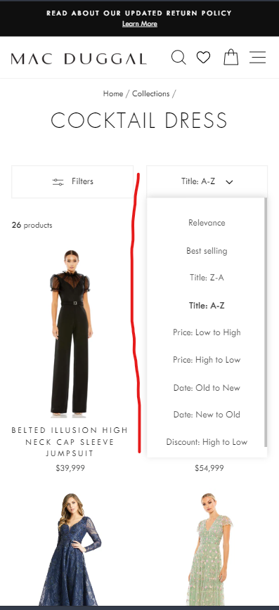

```javascript

/////////////////////////////////////////////////////////
// Dropdown list
var UsfDropDown = {
    props: {
        value: String,
        options: Array,
        placeholder: String,
    },

    data() {
        return {
            show: false
        }
    },

    methods: {
        onInput(e){
            usf.utils.stopEvent(e);
            this.onClose();
            this.$emit('input', e.target.getAttribute('data-value'));
        }, 

        onToggle(e){
            usf.utils.stopEvent(e);

            setTimeout(() => {
                var show = this.show = !this.show;
            
                document.body.classList[show ? 'add' : 'remove']('usf-has-popup');
                document.body[show ? 'addEventListener' : 'removeEventListener']('mousedown', this.onClose);
            }, 0);
        },

        onClose(e){
            if (e)
            { 
                var target = e.target;
                if (target.closest('.usf-c-select') && !target.classList.contains('usf-remove'))
                    return;
            }
                
            this.show = false;
            console.log('[USF Select] - popup to close');

            document.body.classList.remove('usf-has-popup');
            document.body.removeEventListener('mousedown', this.onClose);
        }
    },

    render(h) {
        var opts = this.options;
        if (!opts)
            return;
        
        var selectedLabel = opts.find(i => i.value == this.value);
        selectedLabel = selectedLabel ? selectedLabel.label : this.placeholder;

        var options = [];
        for (var i = 0; i< opts.length; i++){
            var o = opts[i];
            options.push(
                h('button', {
                    class: {
                        'usf-c-select__btn usf-btn': true,
                        'usf-selected': this.value === o.value
                    },
                    domProps: {innerHTML: o.label},
                    on: {
                        click: this.onInput
                    },
                    attrs: {
                        'data-value': o.value
                    }
                })
            );
        }
        
        return h('div', { 
                class: 'usf-c-select' + (this.show ? ' usf-opened' : ''), 
            }, [
                h('button', {class: 'usf-c-select__input-value usf-btn', on: {click: this.onToggle}, domProps: {innerHTML: selectedLabel}}),

                h('div', {class: 'usf-popover', ref: 'p',
                        attrs: {
                            'aria-hidden': !this.show
                        },
                    }, [                    
                    h('div', {class: 'usf-body'}, [
                        // header
                        usf.isMobile ? h('div', {class: 'usf-c-select__header'}, [
                            // close icon
                            h('div', {class: 'usf-remove', on: {click: this.onClose}}),
                            h('span', {class: '', domProps: {innerHTML: this.placeholder}})
                        ]) : null,
            
                        // content
                        h('div', {class: 'usf-c-select__content'}, [
                            h('div', {class: 'usf-c-select__list'}, options),
                        ])
                    ])
                ])
            ]);
    }
}
usf.register(UsfDropDown, null, 'new-dropdown');

```

```css

.usf-mobile .usf-popover .usf-body {
    position: absolute;
    bottom: unset; 
    min-width: unset;
}
.usf-mobile .usf-popover:before,
.usf-c-select__header {
    display: none;
}
.usf-mobile .usf-c-select__btn.usf-btn {
    padding: 10px;
}
.usf-mobile .usf-popover[aria-hidden=true] .usf-body {
    transform: unset; 
}

```
